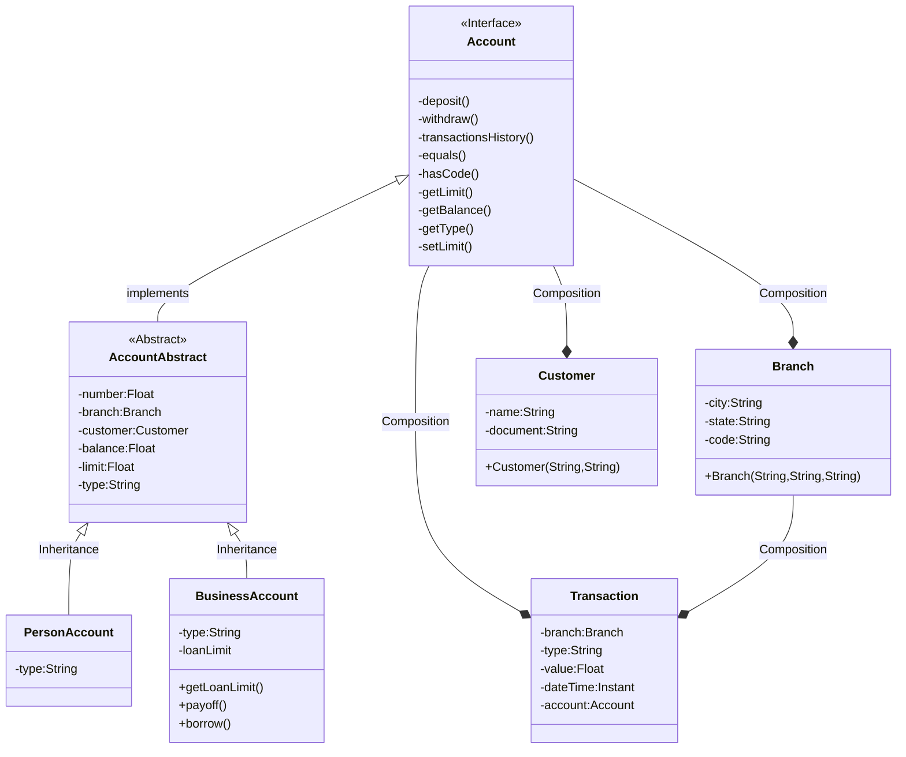

# RyC Banking Application JAVA

## APPLICATION IN PROGRESS
Please note that this application is still under development and is not yet finalized. Certain features may be incomplete or subject to change.

## Main Class
The main class for running the Java application is located at the following path:
src/application/Main.java

To run the application, you can execute the Main class.

## Usage
To use the application, follow these steps:
1. Ensure you have Java installed on your system.
2. Navigate to the directory containing the Main.java file.
3. Compile the Java files if necessary.
4. Run the Main class using the `java` command.

## Contributors
- Camila Fukuda

## Class Diagram

