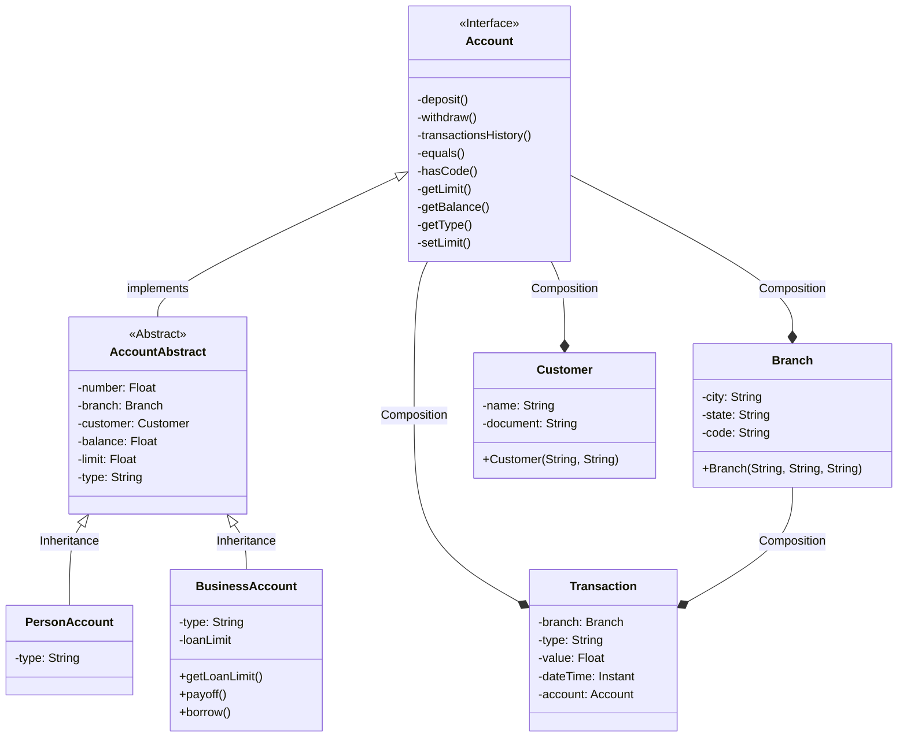

# RyC Banking Application JAVA

## APPLICATION IN PROGRESS

Please note that this application is still under development and is not yet finalized. Certain features may be
incomplete or subject to change.

## Main Class

The main class for running the Java application is located at the following path:
src/application/Main.java

To run the application, you can execute the Main class.

## Next Tasks

Please note that the following list represents tasks I've prioritized for now, but it's not definitive and may evolve
over time. (LAST UPDATE:  2024-04-13)

- [X] Improve the exception treatment in AccountServices when creating a Person Account;
- [ ] Create test classes;
- [ ] Finish all person account actions;
- [ ] Start the business account logic;

## Points to Improve

- Some operations should be available only to "employees" and others to customers;
- Separate the menu by sections (Person Account, Business Account, Customer, Branch);

## Usage

To use the application, follow these steps:

1. Ensure you have Java installed on your system.
2. Navigate to the directory containing the Main.java file.
3. Compile the Java files if necessary.
4. Run the Main class using the `java` command.

## Contributors

- Camila Fukuda

## Banking Operations

This is a relation of banking operations that should be available. Some of them are still a work in progress.

### Account Operations

- For Accounts (person account or business account):
    - Create account;
    - List all accounts;
    - Find account by code;
    - Get limit;
    - Set limit;
    - Deposit an amount;
    - Withdraw amount;
    - Get balance;
    - Transfer amount to another account;
- For Business Account
    - Get loan limit;
    - Pay loan;
    - Get loan;
    - Set loan limit;

### Customer Operations

- Create customer;
- List all customers;
- Find customer by name;
- Find by document;

### Branch Operations

- Create branch;
- List all branch;
- Find branch by code;

## Class Diagram

